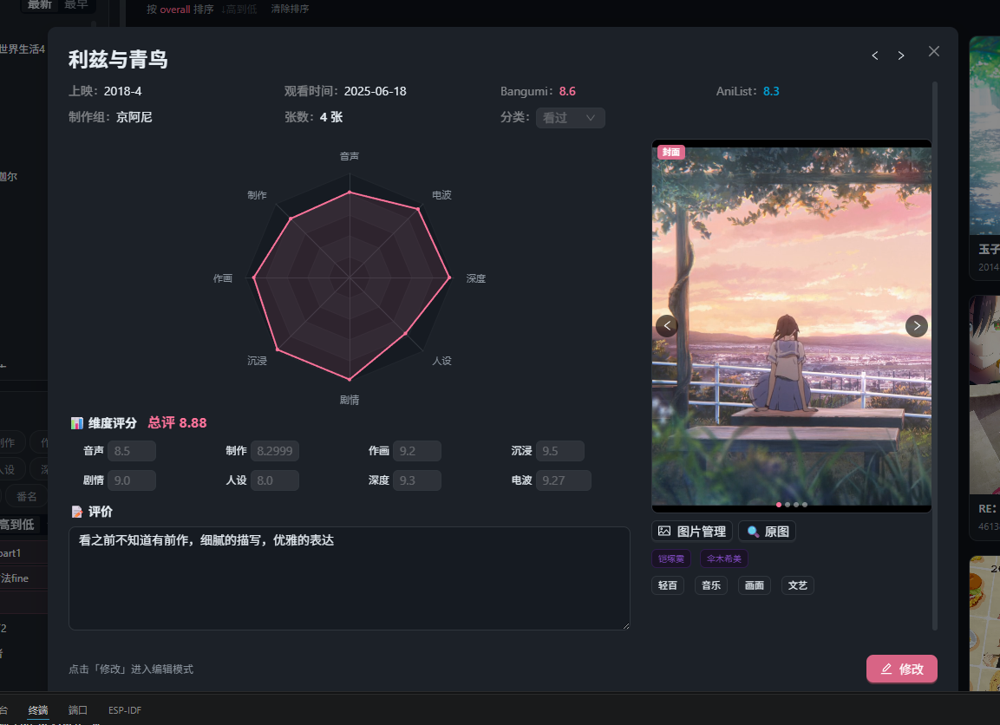

# AnimeDiary — 番剧评分管理系统

> "记录你与每部番的相遇"

## 简介

AnimeDiary 是一款**番剧个人管理工具**，帮你记录看过的每一部番、对每个维度打分、追踪追番日历、分析看番口味。数据保存在本地的 Excel 文件中，同时支持一键备份和恢复。

本项目稍微修改一下也可以用于管理其他影视作品、文学作品、书画、游戏、论文等

> **注意**：AnimeDiary 可以联网访问 Bangumi / AniList 搜番，但评分数据始终在本地。

主界面


详情面板



## 功能对照表

每一件事都对应一个入口：

- **番剧入库** — 搜索添加（支持 Bangumi / AniList 双源），支持分类和标签
- **多维度评分** — 8 个维度（音声 / 制作 / 作画 / 沉浸 / 剧情 / 人设 / 深度 / 电波），加权计算总评
- **排名系统** — 百分位排名 + 按维度排序筛选
- **雷达图** — 单番能力图 + 偏好画像对比
- **知识图谱** — 力导向图展示番剧 / 制作公司 / 标签 / 角色之间的关系
- **追番日历** — 按首刷时间排列的时间轴视图
- **AI 分析套件** — 6 个分析能力：
  - 品味报告 — 基于评分数据的口味分析
  - 偏好画像 — 输出你的看番偏好画像
  - 智能推荐 — 基于偏好推荐未看过的番
  - 单番分析 — 对一部番进行深度分析
  - 知识图谱优化 — AI 辅助完善关系网络
  - 自动打 Tag — 批量智能标签
- **海报管理** — AniList 搜索海报 + 本地存储 + Excel 持久化
- **图片管理** — 本地截图上传 / 删除 / 设为海报
- **Excel 双向同步** — 程序内修改自动写回 Excel，Excel 手动修改也可被程序读取
- **一键备份 / 恢复** — 导出 ZIP（含数据 + 图片），导入即可完整恢复

## 技术栈

| 层面      | 技术                                                |
| --------- | --------------------------------------------------- |
| 前端框架  | React 18 + TypeScript                               |
| UI 组件库 | Ant Design 5                                        |
| 图表      | ECharts 5                                           |
| 构建工具  | Vite 6                                              |
| 桌面壳    | Electron 33                                         |
| 数据存储  | Excel (.xlsx) + localStorage + IndexedDB            |
| 外部 API  | Bangumi、AniList、LLM（DeepSeek / OpenAI 兼容协议） |
| 测试框架  | Vitest + @testing-library/react                     |

## 架构

项目按**单点职责**分层，每个业务模块独立分管一块功能：

```
AnimeDiary/
├── core/                     (4 文件)  纯工具函数（数学/颜色/文本/日期）
├── features/                 (28 文件) 8 个业务模块
│   ├── ai-analysis/          (13 文件) AI 分析套件（6 个 Skill）
│   ├── anime-data/           (4 文件)  数据持久层
│   ├── anime-detail/         (1 文件)  ScoreSlider 评分滑块
│   ├── image-management/     (2 文件)  图片管理
│   ├── knowledge-graph/      (3 文件)  知识图谱
│   ├── ranking/              (1 文件)  排名服务
│   ├── search-add/           (1 文件)  搜索添加
│   └── watch-calendar/       (1 文件)  追番日历
├── context/                  (1 文件)  React Context + useReducer 全局状态
├── tests/                    (6 文件)  76 个单元 + 集成测试
├── specs/                    (7 文件)  功能需求文档
├── electron/                 (2 文件)  Electron 主进程 + 预加载
└── src/                      (15 文件) 应用层（组件 + 页面 + 样式）
```

**数据流**：

```
Excel 文件 ←→ Vite API 中间件 ←→ excelService ←→ App State (Context) ←→ UI 组件
localStorage/IndexedDB ←→ storageService ←→ App State (Context) ←→ UI 组件
外部 API (Bangumi/AniList/LLM) ←→ 各 Service ←→ UI 组件
```

## 快速开始

### 环境要求

- Node.js >= 18
- npm >= 9

### 安装与启动

```bash
# 1. 克隆仓库
git clone <repo-url>
cd AnimeDiary

# 2. 安装依赖
npm install

# 3. 启动开发（纯 Web 模式，浏览器访问 http://localhost:5173）
npm run dev:web

# 4. 启动开发（Electron 桌面模式）
npm run dev
```

### 构建桌面应用

```bash
npm run build
# 输出在 release/ 目录
```

### 运行测试

```bash
npm test              # 单次运行 76 个测试
npm run test:watch    # 监听模式
```

## AI 功能配置

AI 分析功能需要配置 LLM 接口，支持 DeepSeek / OpenAI 兼容协议。

1. 打开程序后点击左下角 **AI 设置**
2. 填入 API Key、Base URL 和模型名称
3. 选择你想使用的 AI Skill

## License

MIT
